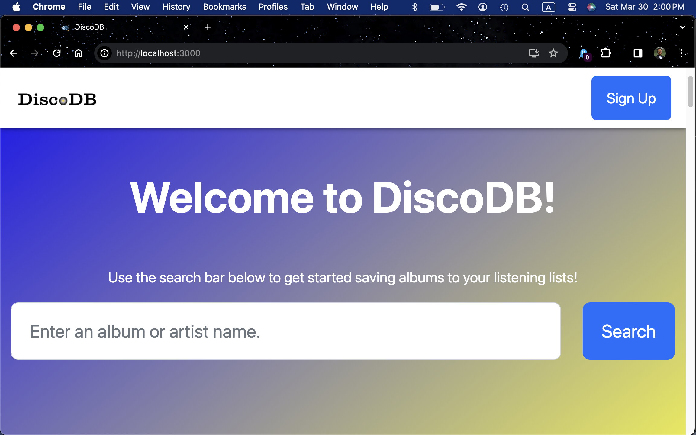
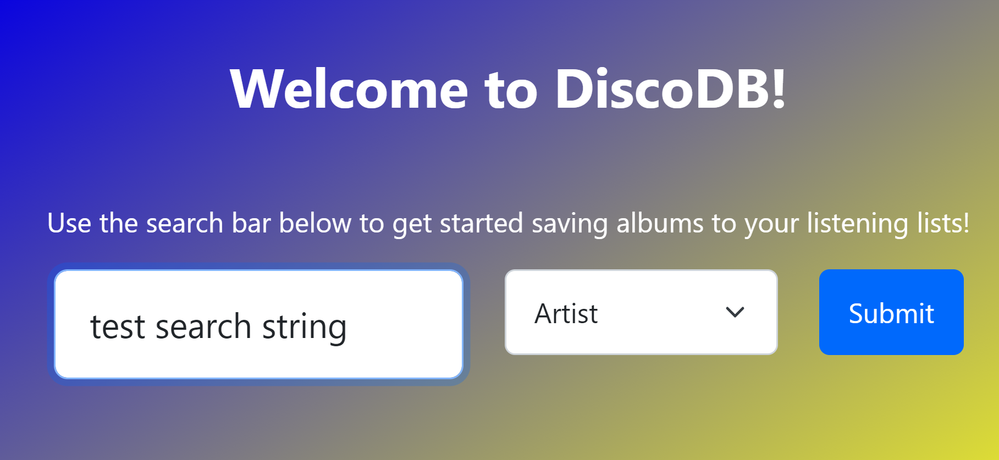
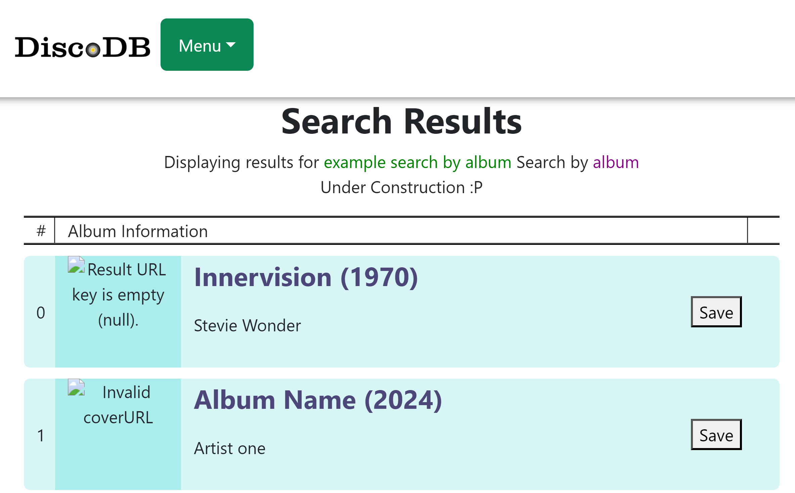

[](https://classroom.github.com/a/XJErSDDc)
^ due 4-29

# DiscoDB
This repository contains the code for our database application, "DiscoDB".

The goal is to allow users to search for and save albums to "listening lists", 
similar to how goodreads allows readers to save books they want to read.

The frontend is hosted on port 3000, the backend is hosted on port 8080. See the Dockerfiles.

Currently, the system is set to run for one user with this information:
```js
{
    user_id: 123456
    username: "testUser"
}
```
Make sure to run `POST /create_user?username="testUser"&user_id=123456` so that this user is created and you can interact with their listening tables :)

# Directory Structure / Docker
Note: You may have to have `docker` desktop running in order to start up and run our docker image.

Reference repository: 
https://github.com/docker/awesome-compose/blob/master/react-express-mysql/

```
.
├── backend
│   ├── Dockerfile
│   ...
├── db
│   └── password.txt
├── compose.yaml
├── frontend
│   ├── ...
│   └── Dockerfile
└── README.md
```

For ease, I will write this on files that are from this reference:
```js
/* ======================== (start) REFERENCE:github/docker ==================   */
/* Description of our usage of the reference + any modifications made if at all. */
/* ----------------------------------------------------------------------------- */
const exampleCodeFromReference = exampleFuncCall();
/* ======================== ( end ) REFERENCE:github/docker ==================    */
```
- this is ommitted for *.json because I can't make comments :P

# ======================== (start) REFERENCE:github/docker ==================
- Description: docker command instructions for the repository.
- Changes from Reference: 
    - separate the command to run from its expected output
    - expected output should use our repo name instead of react-express-mysql
## Deploy with docker compose
Command:
```bash
docker compose up -d
```
Note from Jess T. : I recommend the `-d` flag because if you don't your console gets filled up with status logs. Just use docker desktop to see the logs.

Output:
```bash
$ docker compose up -d
Creating network "react-express-mysql_default" with the default driver
Building backend
Step 1/16 : FROM node:10
 ---> aa6432763c11
...
Successfully tagged project-discodb_frontend:latest
WARNING: Image for service frontend was built because it did not already exist. To rebuild this image you must use `docker-compose build` or `docker-compose up --build`.
Creating project-discodb_db_1 ... done
Creating project-discodb_backend_1 ... done
Creating project-discodb_frontend_1 ... done
```

## Expected result

Listing containers must show containers running and the port mapping as below.

Command:
```bash
docker ps
```

Output:
```bash
$ docker ps
CONTAINER ID        IMAGE                          COMMAND                  CREATED             STATUS                   PORTS                                                  NAMES
f3e1183e709e        project-discodb_frontend   "docker-entrypoint.s…"   8 minutes ago       Up 8 minutes             0.0.0.0:3000->3000/tcp                                 project-discodb_frontend_1
9422da53da76        project-discodb_backend    "docker-entrypoint.s…"   8 minutes ago       Up 8 minutes (healthy)   0.0.0.0:80->80/tcp, 0.0.0.0:9229-9230->9229-9230/tcp   project-discodb_backend_1
a434bce6d2be        mysql:8.0.19                   "docker-entrypoint.s…"   8 minutes ago       Up 8 minutes             3306/tcp, 33060/tcp                                    project-discodb_db_1
```

After the application starts, navigate to `http://localhost:3000` in your web browser.

The backend service container has the port 80 mapped to 80 on the host.
```
$ curl localhost:80
{"message":"Hello from MySQL 8.0.19"}
```

Stop and remove the containers

Command:
```shell
docker compose down
```
Output:
```
$ docker compose down
Stopping project-discodb_frontend_1 ... done
Stopping project-discodb_backend_1  ... done
Stopping project-discodb_db_1       ... done
Removing project-discodb_frontend_1 ... done
Removing project-discodb_backend_1  ... done
Removing project-discodb_db_1       ... done
Removing network project-discodb_default

```
## In case of failure (How I somewhat reset a docker image)
Section Author: Jess Turner

Run the following commands. I know this isn't ideal at all because it deletes ALL your docker containers, but this is just what may have worked as of 4/22 when I wanted to reset my backend docker image.
- Recalling the problem in case you wonder if you are in this same "emergency" that I had: ( I updated the packages and I was constantly getting package not found "cors" errors as well as the app was using the wrong port, 5001 (i.e. when viewing the docker layers) likely because of docker caching an earlier version of the system which used that port )
```shell
docker system prune
docker build --no-cache backend
```
I suppose you can replace backend with whichever image is giving you trouble :P

Then you can re-run the app with
`docker compose up -d` as usual.


## In case of failure (How I somewhat reset a docker image)
Section Author: Jess Turner

Run the following commands. I know this isn't ideal at all because it deletes ALL your docker containers, but this is just what may have worked as of 4/22 when I wanted to reset my backend docker image. Unfortunately this doesn't consistently work, but it's worth a try :/
- Recalling the problem in case you wonder if you are in this same "emergency" that I had: ( I updated the packages and I was constantly getting package not found "cors" errors as well as the app was using the wrong port, 5001 (i.e. when viewing the docker layers) likely because of docker caching an earlier version of the system which used that port )
```shell
docker system prune
docker build --no-cache backend
```
I suppose you can replace backend with whichever image is giving you trouble :P

Then you can re-run the app with
`docker compose up -d` as usual.

### Other commands that may help in case of failure
According to this github thread on docker/postgress, you can do `docker rm [instance-name]`

For example, on 4-25 ~8:45pm, I'm trying to reset the mySQL docker image (i.e. delete and re-create) using a different database table name based on my change in the `compose.yaml` file. This is what I attempted before rerunning "docker compose up". It didn't work for me, but it may work for you :p
```
PS C:\...\jturn>docker ps -a
CONTAINER ID   IMAGE                      COMMAND                  CREATED          STATUS                      PORTS                    NAMES
7a91f30eea9c   project-discodb-frontend   "docker-entrypoint.s…"   31 minutes ago   Up 31 minutes               0.0.0.0:3000->3000/tcp   project-discodb-frontend-1
8d94fb992915   project-discodb-backend    "docker-entrypoint.s…"   31 minutes ago   Exited (1) 29 minutes ago                            project-discodb-backend-1
d15ae67dfa4c   mysql:8.0.27               "docker-entrypoint.s…"   31 minutes ago   Exited (0) 30 seconds ago                            project-discodb-db-1
PS C:\...\jturn>docker rm project-discodb-db-1
project-discodb-db-1
```

# Appearance
<figure>
    
    <figcaption>When you open the app you are greeted with a search header that looks like this!</figcaption>
</figure>

__**New!**__

 Now you can enter something to the text box on the HomePage (We store it in `location.state.searchString`) then it takes you to the SearchResults page and shows you what you entered. I applied a similar procedure to store the result of the user's `searchBy` dropdown selection.
 
 So far, there is no API call to actually query the database based on the input.
<figure>
    
    
    <figcaption>Progress by 4/17: HomePage sends searchString to SearchResults page so it can request the search info from the backend and display it. </figcaption>
</figure>

# [Internal] Sharing information between pages
^ Note for developers:
- Send information by using `navigate`
```js
import { useNavigate } from 'react-router-dom';


export default function SenderComponent() {
    const navigate = useNavigate();
    const value = "Send me!"; // usually from state. See "CustomSearchBar.js"
    // example from "Home/CustomSearchBar.js"
    navigate("/RecipientPage", {state:{attributeName: value}});
}
```
- Receive information by using `location`
```js
import { useLocation } from 'react-router-dom';
// i.e. This is routed at "/RecipientPage"
export default function RecipientComponent() {
    // initialize location variable!
    location = useLocation();

    console.log("Received data: ", location.state.attributeName);
}
```

## Pulling the current dataset
1. Go to this [Google Drive link](https://drive.google.com/drive/u/1/folders/1pKdHyqLQyvNPYMsrdXC8M1apf1UDdFR4)
2. download all of the files in the folder 
    (the files are titled as follows: "discogs_20240201_artists_modified", "found_missing_releases_masters", "main_releases_modified", and "recovered_missing_releases_modified").
3. Navigate to and put those downloads in the `db` folder.
4. Change the `ROOT_PATH` in `process_data.py`
5. Run `setup_sql.py
. The setup file does not yet exist, but these will be the appropriate steps to follow once it is uploaded.
